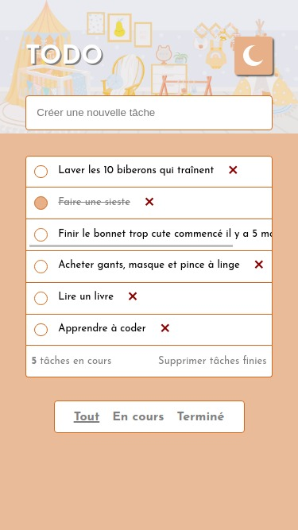
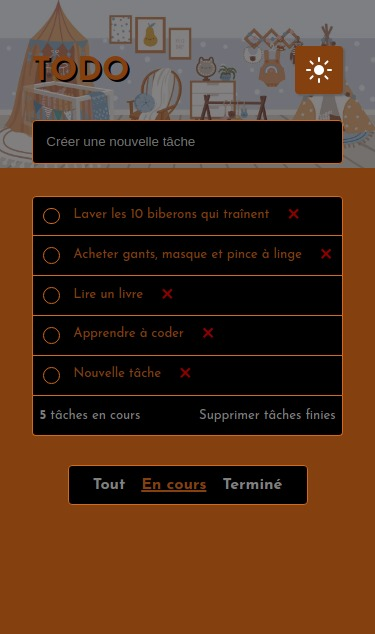
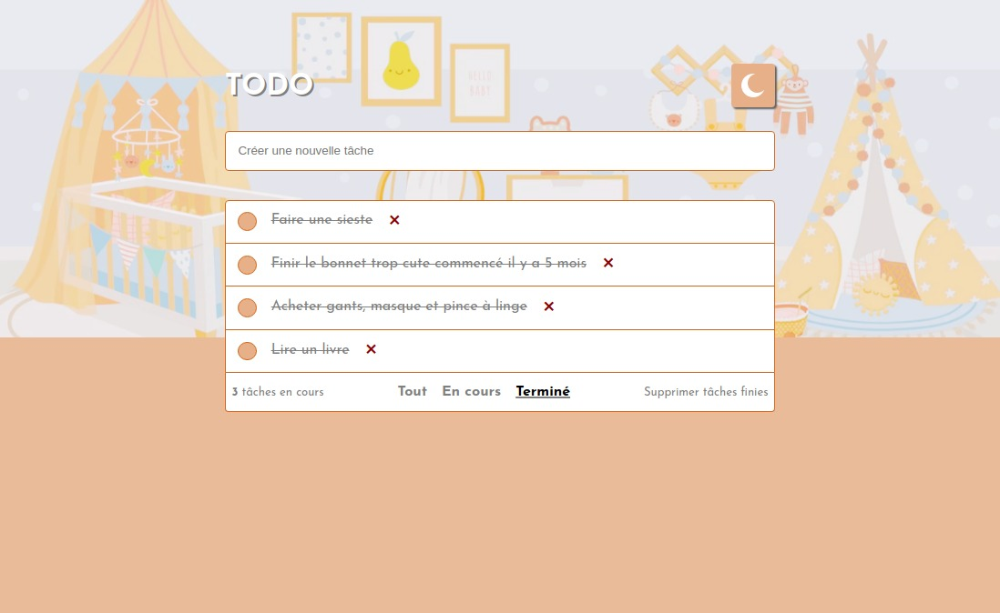

## Objectifs

- Utiliser React (hooks, router, state local et props)
- Créer une application CRUD avec les données du state
- Créer une application en mobile-first design

## Outils

- HTML / CSS
- Mobile-first workflow
- React (Hooks et Router)

## Brief

Les utilisateurs doivent être en mesure de :

- Voir les états de survol/clic de tous les éléments interactifs de la page
- Ajouter de nouvelles tâches à la liste
- Marquer les tâches comme terminées
- Supprimer des tâches de la liste (individuellement ou de manière groupée)
- Filtrer par tâches toutes/actives/terminées
- Basculer en Dark Mode
- Afficher la mise en page optimale en fonction de la taille d'écran de leur appareil

# Screenshots

